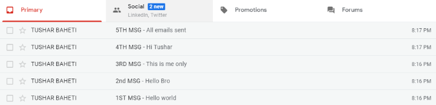

# Gmail Email Fetcher using Python

## 📌 Overview
This project demonstrates how to fetch Gmail emails from a specific sender using Python. Gmail provides IMAP access which allows users to retrieve emails without logging in via a browser. Using Python libraries, we can automate inbox monitoring and email extraction efficiently.

---

## 🧠 Use Case
If you want to:
- Fetch emails from a particular Gmail user
- Automate inbox monitoring
- Extract email body content programmatically

Then this project is perfect for you.

---

## 🛠️ Technologies Used
- Python 3.x
- imaplib
- email

---

## ⚙️ Prerequisites
1. Python 3 installed
2. Gmail account
3. IMAP enabled in Gmail
4. App Password (recommended)

---

## 🔐 Enable IMAP in Gmail
1. Login to Gmail
2. Go to **Settings → See all settings**
3. Open **Forwarding and POP/IMAP**
4. Enable **IMAP Access**
5. Save changes

---

## 🚀 How It Works
- Connects securely to Gmail via IMAP
- Logs in using credentials
- Selects Inbox label
- Searches emails from a specific sender
- Fetches and stores emails in a list
- Extracts and prints email body content

---

## 📤 Output
- Prints email body text in terminal
- Emails are displayed in the order received

---

## 🧪 Example Scenario
Emails were sent from another Gmail account and fetched successfully using this script, demonstrating sender-based email retrieval.

---

## 📸 Screenshot

---

## ⚠️ Disclaimer
Use this script responsibly. Avoid violating Gmail policies or accessing accounts without permission.
